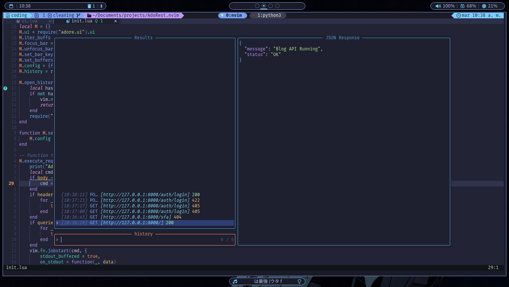
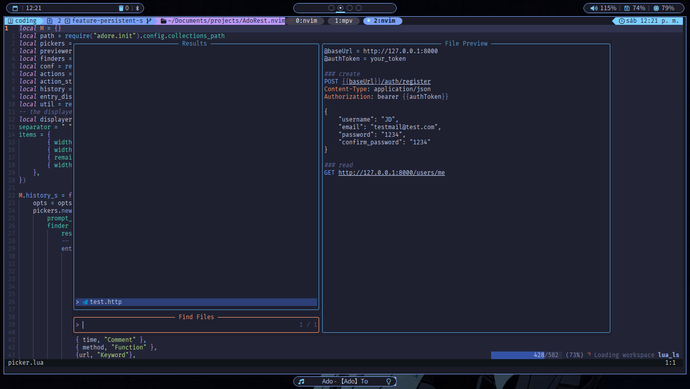
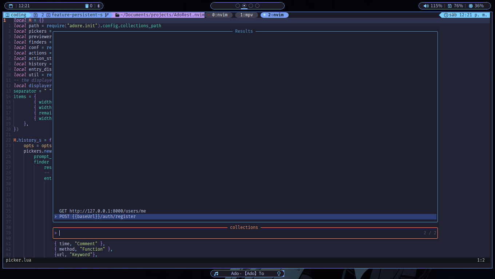
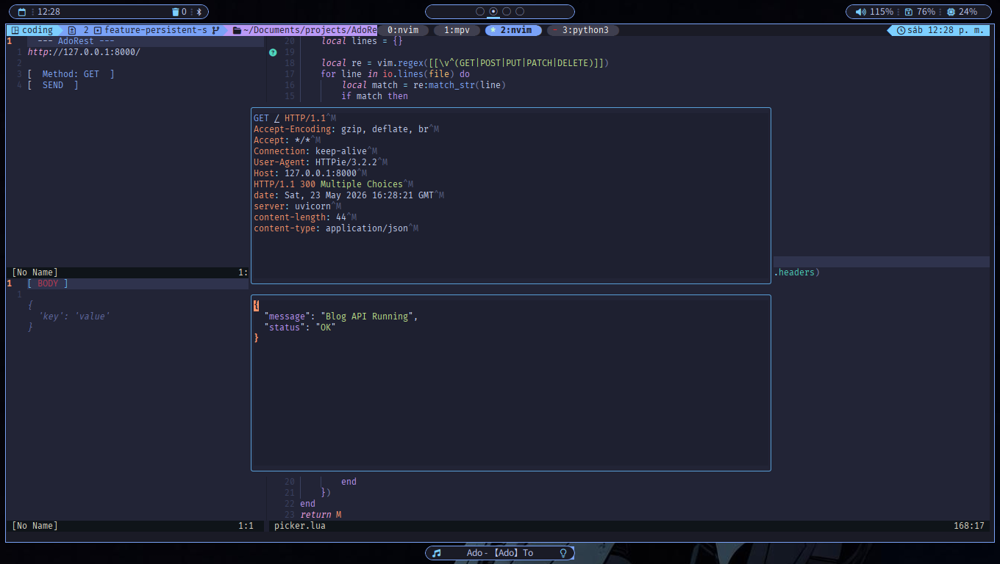

# AdoRest.nvim 🎤
### Request Workflow
[request](https://github.com/user-attachments/assets/24191ae6-30ab-417f-bb67-e76bb57e3d08)

### Open AdoRest bar
[open_close](https://github.com/user-attachments/assets/a2674d30-bc61-4865-b191-1060f9082428)

### Focus and Unfocus
[focus_unfocus](https://github.com/user-attachments/assets/cef0d0a2-0be3-4d7a-b0cc-516d46f3a80c)

A lightweight, asynchronous HTTP client for Neovim inspired by Thunder Client. 
Written in Lua, powered by **httpie**.
## ✨ Features
* **Sidebar Menu**: Manage your requests in a dedicated, non-intrusive sidebar.
* **Asynchronous**: Doesn't block your Neovim UI. Your editor stays responsive while waiting for the server.
* **Auto-Formatting**: Automatic JSON syntax highlighting for responses.
* **Integrated**: Designed to work alongside `nvim-tree` and other sidebars without layout breaking.
* **Full Requests History**: Navigate through your recently sent requests and responses.
* **Requests with Collections**: Send saved requests using `.http` files.
## 📋 Prerequisites
You need to have `httpie` installed in your system:
```bash
# Ubuntu/Debian
sudo apt install httpie

# Arch Linux
sudo pacman -S httpie
```
`jq` is also required for JSON formatting:
```bash
# Ubuntu/Debian
sudo apt install jq

# Arch Linux
sudo pacman -S jq
```
## 🚀 Installation
Using lazy.nvim:
```Lua
return {
  "JD1705/AdoRest.nvim",
  -- dependencies = { "nvim-telescope/telescope.nvim" } -- only needed if you want to use the history and collections
}
```
## Configuration
```Lua
require("adore").setup({
    -- bar_pos: position of the bar, can be right or left
    bar_pos = "left", -- default is "right"
    -- floating_border: change the border for the response floating window
    floating_border = "rounded", -- default is "single"
    -- bar_width: AdoRest bar width
    bar_width = 30, -- default is 50
    -- collections_path: the place where you save the collections
    collections_path = "collections/" -- default is "tests/request"
})
```
### Setup Parameters
| Parameter        | Type    | Valid Options   |
| ---------------- | ------- | --------------- |
| bar_pos          | string  | "left"          |
|                  |         | "right"         |
| floating_border  | string  | "rounded"       |
|                  |         | "single"        |
|                  |         | "none"          |
|                  |         | "double"        |
|                  |         | "solid"         |
| bar_width        | integer | 50              |
| collections_path | string  | any string path |
## Telescope Integration
For advanced features such as Request History and Collections, `telescope.nvim` is required. These features are optional, and `AdoRest.nvim` remains fully functional without them.
### Request History

Using the `AdoRestHistory` command you can display a list of the recently sent request, showing the Timestamp, Method, URL and Status code. If you select one, it will open a floating window with the response received from that request (actually only displays the JSON).
### Request Collections

If you have saved request collections somewhere in your project, you can access to them using the command `AdoRestCollections`, this will display the window showed in the picture where you can select the respective file to use.

After selecting the file, this will extract each request from it (looking for the lines with a Method and URL) so you can select which one to send as a request.
You can define the path where you save your collections through [Configuration](#Configuration).
## Keymaps
- `<Tab>` to switch between the control section (url and buttons) and the data section (body, header & query)
- `h` and `l` to move between buffers in the data section
- `q` to close the windows
- `<Esc>` to unfocus the bar and `<Alt><Esc>` to focus it back
## Commands
- `:AdoRest` opens the sidebar
- `:AdoRestFocus` set the cursor on the sidebar if is open
- `:AdoRestUnfocus` set the cursor on the editor window
- `:AdoRestRequest` send the request (only if the AdoRest bar is open)
- `:AdoRestHistory` open a telescope window with the history of request/responses
- `:AdoRestCollections` open a telescope window with the collections (if you have any)
## 🛠 Usage
1. Open the sidebar with `:AdoRest` or with
2. Modify the URL in the second line
3. Move to the next window with `Tab` and modify the body, header and queries
4. Move the cursor to the send line 
5. Press `Enter` to execute the request.
6. The response will appear in a floating window

## Support
if you find this plugin useful and want to support my work, feel free to buy me a coffee!
[](https://ko-fi.com/jd1705)
